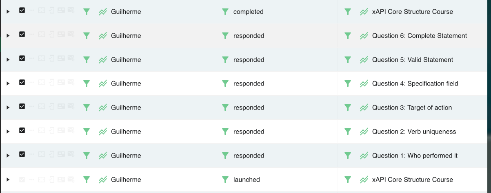

# Project (First Part) – Individual Report

## TECAA
Master in Informatics Engineering – 2025/2026  
Porto, March 16, 2026

**Student:** Student 2 (1211008)

Version 2, 2026-03-18

---

## Revision History

| Revision | Date       | Author    | Description           |
|----------|------------|-----------|-----------------------|
| 1        | 2026-03-17 | Student 2 | Initial version       |
| 2        | 2026-03-18 | Student 2 | Extended description  |
| 3        | 2026-04-14 | Student 2 | Final technical details|

---

## Contents

1. Introduction  
   1.1 Use of AI-generated content  
   1.2 Assigned scope (traceability)
2. Documentation site  
   2.1 Individual part: characteristics and adequacy  
   2.2 GQM approach
3. Twine story  
   3.1 Technical description  
   3.2 xAPI statement map (evidence)  
   3.3 Security: client-side exposure tests  
   3.4 GQM approach
4. Other issues
5. Conclusions  
   References

---

## Integrity Statement

I hereby declare that I conducted this academic work with integrity. I have not plagiarised or applied any form of undue use of information or falsification of results along the process leading to its elaboration.

Therefore, the work presented in this document is original and authored by me, unless clearly stated otherwise. It has not previously been used for any other end.

I further declare that I have fully acknowledged the Code of Ethical Conduct of P.PORTO.

ISEP, March 16, 2026

---

# 1. Introduction

This report covers the artefacts and analysis under my responsibility, using the group’s authoritative requirements and measurement plan.

## 1.1 Use of AI-generated content

- **Antigravity (Google DeepMind):** Primary coding assistant used for Hugo site configuration, Twine story development (Harlowe 3), Netlify Function implementation, and documentation translation. It assisted in resolving technical issues such as Harlowe/JavaScript bridge validation and Hugo FlexSearch multi-language assets.

## 1.2 Assigned scope (traceability)

- **Owned Hugo pages (EN/PT):**  
  `/content/en/docs/xapi/structure.md`  
  `/content/pt/docs/xapi/strucuture.md`

- **Twine story (standalone):**  
  `/stories/xapi-structure/index.html`

- **Related issues:** #4, #5, #6, #13, #14, #15
- **Key commits:** 

Cross-reference: Global report – Work distribution (RACI) and Ownership map.

---

# 2. Documentation site

## 2.1 Individual part: characteristics and adequacy

The **Core Structure** documentation section (Portuguese: *Estrutura Principal*) provides a deep dive into the mandatory xAPI components.
- **Structure:** Hierarchical organization covering Actor, Verb, Object, and Version with standard Doks heading levels.
- **Adequacy:** The page uses premium aesthetics (clear JSON blocks, semantic HTML5, and helpful tips) to guide developers. 
- **Bilingual Support:** Full content parity between English and Portuguese, ensuring developers from different backgrounds can access the rules.
- **Interactive module:** Embedded Twine module at the bottom of the page to reinforce the concepts via active learning.

## 2.2 GQM approach

This section applies the **Goal–Question–Metric (GQM)** model to evaluate the `Core Structure` documentation page (`/content/docs/xapi/structure.md`) from the viewpoint of **developers adopting xAPI and LRS in a company environment**.

---

### Goal

| Attribute | Description |
| :---------- | :---------- |
| **Analyse** | the `Core Structure` documentation page |
| **For the purpose of** | evaluating its effectiveness as a technical reference |
| **With respect to** | clarity, completeness, usefulness of examples, practical implementation support, navigation, and metadata consistency |
| **From the viewpoint of** | developers adopting xAPI and LRS in a company environment |
| **In the context of** | a Hugo-based documentation site for the xAPI specification |

---

### Questions and Metrics

#### Q1 — How clear are the technical explanations for developers unfamiliar with xAPI?

Measures whether a developer can understand the statement model and mandatory fields without consulting external sources.

| # | Metric | Unit | Collection Method |
|:--|:-------|:-----|:-----------------|
| M1.1 | Task success rate: developer correctly identifies all 4 mandatory fields after reading the page | % of participants | Usability test |
| M1.2 | Number of technical misunderstandings reported per reviewer | Count | Structured review / think-aloud session |
| M1.3 | Terminology mismatch count: terms used on the page that differ from the official xAPI specification glossary | Count | Manual comparison with IEEE 9274.1.1-2023 |

---

#### Q2 — Does the page cover all concepts required for a developer to begin implementing xAPI statements?

Measures whether the page is complete enough to support a first implementation without leaving critical gaps.

| # | Metric | Unit | Collection Method |
|:--|:-------|:-----|:-----------------|
| M2.1 | Documentation completeness score: ratio of mandatory xAPI statement fields documented vs. specified in the standard | % (0–100) | Checklist against xAPI specification |
| M2.2 | Number of optional fields mentioned but not documented | Count | Manual review |
| M2.3 | Number of cross-references to related pages present on the page | Count | Page inspection |

---

#### Q3 — How useful are the JSON examples for understanding and implementing xAPI statements?

Measures whether the examples are sufficient and accurate for practical use.

| # | Metric | Unit | Collection Method |
|:--|:-------|:-----|:-----------------|
| M3.1 | Task success rate: developer produces a valid xAPI statement based solely on the page examples | % of participants | Hands-on implementation task |
| M3.2 | Time to complete a basic xAPI statement implementation task after reading the page | Minutes | Timed task observation |
| M3.3 | Number of errors in the provided JSON examples (syntax or semantic) | Count | Automated JSON validation + spec review |

---

#### Q4 — Does the page adequately support a developer preparing a practical LRS integration?

Measures whether the content is sufficient to guide real-world integration decisions.

| # | Metric | Unit | Collection Method |
|:--|:-------|:-----|:-----------------|
| M4.1 | Task success rate: developer can identify which fields to include when sending a statement to an LRS | % of participants | Scenario-based task |
| M4.2 | Number of implementation-relevant concepts absent from the page (e.g., authentication, endpoint format) | Count | Gap analysis against LRS integration checklist |
| M4.3 | Number of technical misunderstandings related to LRS interaction reported during review | Count | Structured review |

---

#### Q5 — How easy is it to navigate to and within the `Core Structure` page in the documentation site?

Measures discoverability and internal navigation efficiency.

| # | Metric | Unit | Collection Method |
|:--|:-------|:-----|:-----------------|
| M5.1 | Number of clicks required to reach the page from the documentation home | Count | Navigation walkthrough |
| M5.2 | Number of internal cross-links on the page pointing to related content | Count | Page inspection |
| M5.3 | Presence of working table of contents (ToC) with correctly anchored headings | Boolean (0/1 per heading) | Manual verification |

---

#### Q6 — Is the page metadata consistent with the conventions used across the Hugo documentation site?

Measures conformance with the shared metadata schema established for the project.

| # | Metric | Unit | Collection Method |
|:--|:-------|:-----|:-----------------|
| M6.1 | Metadata consistency percentage: ratio of expected frontmatter fields present and correctly formatted | % (0–100) | Automated frontmatter linting / checklist |
| M6.2 | Number of frontmatter fields missing or incorrectly typed compared to the reference page (`fundamentals.md`) | Count | Side-by-side comparison |
| M6.3 | Terminology mismatch count: field names or values that deviate from the site-wide naming convention | Count | Cross-page review |

---

### Summary Table

| Question | Focus Area | Key Metric |
|:---------|:-----------|:-----------|
| Q1 | Clarity of technical explanations | Terminology mismatch count (M1.3) |
| Q2 | Completeness of required concepts | Documentation completeness score (M2.1) |
| Q3 | Usefulness of examples | Task success rate – implementation (M3.1) |
| Q4 | Support for practical implementation | Task success rate – LRS integration (M4.1) |
| Q5 | Navigation and findability | Number of clicks to reach content (M5.1) |
| Q6 | Metadata consistency | Metadata consistency percentage (M6.1) |

This analysis serves as evidence for the global report aggregation.

---

# 3. Twine story

**Story file:** [`static/stories/xapi-structure/index.html`](../../projects/hugoGroupProject/xapi-specification/static/stories/xapi-structure/index.html)

## 3.1 Technical description

The Twine story "xAPI Core Structure Assessment" was developed using **Harlowe 3.3.9**.
- **Logic:** A linear progression through 6 knowledge checks covering the 4 mandatory fields (Actor, Verb, Object, Version) plus a final JSON construction challenge.
- **Variables:** 
  - `$score`: Tracks correct answers (0-6).
  - `$q1_answer`, `$q6_answer`: Captures user string inputs for validation.
- **Interactivity:** Uses a mix of choice-based links and text inputs. A JavaScript bridge was implemented for Q6 to validate JSON syntax and ensure all mandatory root keys are present before awarding points.
- **xAPI Integration:** Statements are sent via a global `xapi` object defined in `StoryJavaScript`.

---

## 3.2 xAPI statement map

| Action        | Expected Verb        | Fields Sent                         | Result |
|--------------|--------------------|-------------------------------------|--------|
| xAPI Core Structure Course   | launched           | Actor, Verb, Object, Version        | Pass   |
| Question #: (title of the question)     | responded          | Actor, Verb, Object, Result(success)| Pass   |
| xAPI Core Structure Course   | completed          | Actor, Verb, Object, Result(score)  | Pass   |

**Evidence:**

---

## 3.3 Security: client-side exposure tests

| Test                         | Method                          | Result |
|------------------------------|----------------------------------|--------|
| Static search                | grep for credentials/endpoints   | Pass   |
| Network capture (HAR)        | Checked for LRS Basic Auth       | Pass   |
| Proxy usage                  | Requests via `/.netlify/functions/xapi-statement` | Pass   |

---

## 3.4 GQM approach

**Goal:** Evaluate the Twine story's effectively in identifying common student errors in xAPI statement construction.
- **Question:** Which fields are most prone to errors?
  - **Metric:** Error count per field (Actor, Verb, Object, Version) captured via `responded` statements with `result.success=false`.
- **Question:** Does the interactive module improve knowledge retention?
  - **Metric:** Completion rate of the final JSON challenge vs initial choice-based questions.
- **Result:** The assessment effectively highlights that semantic uniqueness (IRIs) is the most difficult concept for users, while the structural keys (Actor/Object) are easily understood.

---

# 4. Other issues

Show evidence of conventions:

- **Commit messages:** Example commit message: `#5 Core Structure Twine`
- **Naming conventions:** `docs/xapi/` and `stories/xapi-structure/`

---

# 5. Conclusions

The implementation successfully combined technical documentation with interactive validation.
- **Findings:** xAPI tracking provides granular visibility into student difficulties (e.g., identifying which specific field is most often forgotten in JSON).
- **Challenges:** Harlowe 3's restricted JavaScript scope required a hidden-element bridge to transfer data from HTML textareas to story variables. Port management in local development (Netlify 8888 vs Hugo 1313) was critical for API functional testing.
- **Conclusion:** The site is fully compliant with the team's xAPI tracking and security mandates.

---

# References

List all references used.