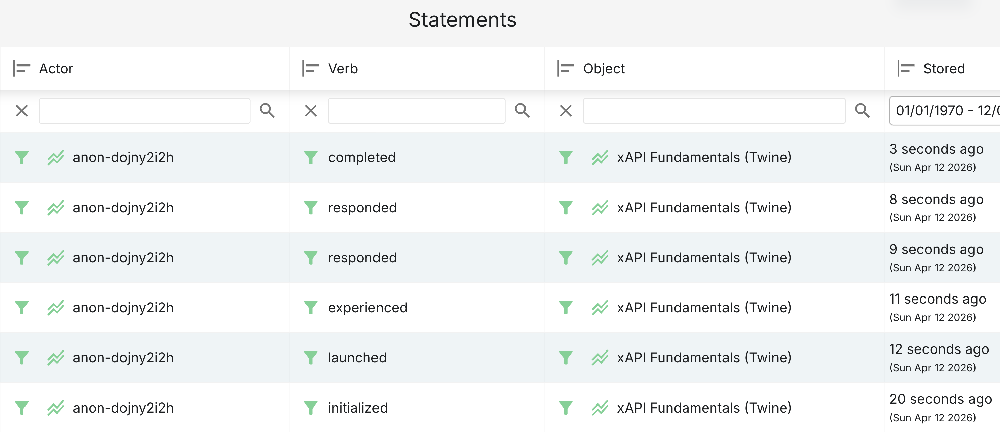

# Project (First Part) – Individual Report

## TECAA

Master in Informatics Engineering – 2025/2026  
Porto, April 14, 2026

**Student:** Miguel Póvoas (1201716)

Version 5, 2026-04-14

---

## Revision History

| Revision | Date       | Author        | Description                                    |
| -------- | ---------- | ------------- | ---------------------------------------------- |
| 1        | 2026-03-17 | Miguel Póvoas | Initial version                                |
| 2        | 2026-03-18 | Miguel Póvoas | Extended description                           |
| 3        | 2026-04-10 | Miguel Póvoas | Corrected identity, repository paths, and URLs |
| 4        | 2026-04-12 | Miguel Póvoas | GQM aligned with global report; Twine;         |
| 5        | 2026-04-14 | Miguel Póvoas | Deploy URL, commits, security evidence         |

---

## Contents

1. Introduction  
   1.1 Use of AI-generated content  
   1.2 Assigned scope (traceability)
2. Documentation site  
   2.1 Individual part: characteristics and adequacy  
   2.2 GQM approach
3. Twine story  
   3.1 Technical description  
   3.2 xAPI statement map (evidence)  
   3.3 Security: client-side exposure tests  
   3.4 GQM approach
4. Other issues
5. Conclusions  
   References

---

## Integrity Statement

I hereby declare that I conducted this academic work with integrity. I have not plagiarised or applied any form of undue use of information or falsification of results along the process leading to its elaboration.

Therefore, the work presented in this document is original and authored by me, unless clearly stated otherwise. It has not previously been used for any other end.

I further declare that I have fully acknowledged the Code of Ethical Conduct of P.PORTO.

ISEP, April 14, 2026

---

# 1. Introduction

This report covers the artefacts and analysis under my responsibility, using the group’s authoritative requirements and measurement plan.

## 1.1 Use of AI-generated content

| AI system                 | Parts of the work                                                                                                                                                      | Manner and extent                                                                                                                                             |
| ------------------------- | ---------------------------------------------------------------------------------------------------------------------------------------------------------------------- | ------------------------------------------------------------------------------------------------------------------------------------------------------------- |
| **Cursor** (coding agent) | Hugo/Twine/repo work: suggestions for scripts, refactors, wiring the xAPI proxy, Netlify/Hugo config, markdown edits, and debugging.                                   | Used as an assistant under my direction: I reviewed, tested, and integrated every change; AI output was not submitted without verification.                   |
| **ChatGPT**               | Reading and summarising dense **xAPI / IEEE-style specification** passages; drafting and polishing **Portuguese** wording for the Fundamentals page and related notes. | Support for interpretation and translation only: technical claims were cross-checked against primary sources; PT text was edited by me for accuracy and tone. |

All metric values, LRS evidence, screenshots, and conclusions in this report are based on my own runs and judgement unless a figure or path explicitly cites a tool export.

## 1.2 Assigned scope (traceability)

- **Owned Hugo pages (repository paths, relative to the group project root):**
  - English: [`/content/en/docs/xapi/fundamentals.md`](../../projects/hugoGroupProject/xapi-specification/content/en/docs/xapi/fundamentals.md)
  - Portuguese: [`/content/pt/docs/xapi/fundamentals.md`](../../projects/hugoGroupProject/xapi-specification/content/pt/docs/xapi/fundamentals.md)

- **Published site paths:**
  - English: `/docs/xapi/fundamentals/`
  - Portuguese: `/pt/docs/xapi/fundamentals/`

- **Twine story:**  
  [`static/stories/xapi-fundamentals/index.html`](../../projects/hugoGroupProject/xapi-specification/static/stories/xapi-fundamentals/index.html)  
  **Public URL:** https://tecaa-isep.netlify.app/stories/xapi-fundamentals/

- **Related issues:** #1, #2, #3, #13, #14, #15

- **Key commits (Fundamentals content + Twine; verify with `git show <hash>`):**

| Issue | Summary                                | Commit hash                                |
| ----- | -------------------------------------- | ------------------------------------------ |
| #2    | xAPI Fundamentals Twine implementation | `e148c03e1d83ec657fd53b501debec9e3ce8e52d` |
| #3    | xAPI Fundamentals report update        | `2e16dff0c292825d58ca71c05dcc101177fcd9fe` |

Cross-reference: Global report – Work distribution (RACI) and Ownership map ([`../group/GlobalReport.md`](../group/GlobalReport.md) §2.2–2.3).

---

# 2. Documentation site

## 2.1 Individual part: characteristics and adequacy

My scope is the **Fundamentals** page in the xAPI documentation section. In the repository it is implemented as:

- **English** markdown at `content/en/docs/xapi/fundamentals.md` (slug `fundamentals`, section `docs` under the multilingual content layout used by the Hugo site).
- **Portuguese** translation at `content/pt/docs/xapi/fundamentals.md`, with the same slug so language switching and complements/fallback behave consistently with the rest of the site.

The page introduces xAPI (purpose, statements Actor–Verb–Object, LRS role, workflow, comparison with SCORM) and cross-links to sibling pages (e.g. structure, validation) where those topics are developed in depth. Navigation to this page is available from the main menu (Docs → fundamentals entry) and from the xAPI section index.

**Checklist alignment (manual QA, production site https://tecaa-isep.netlify.app/):**

- **Bilingual / links:** EN ↔ PT switch on `/docs/xapi/fundamentals/` and `/pt/docs/xapi/fundamentals/` — **Pass**. Internal links to sibling xAPI guides — **Pass** (no broken targets found in the checked navigation paths).
- **Navigation aids:** `title`, `description`, TOC (front matter `toc: true`), menu entry, breadcrumbs, language switch — **Pass** for both languages (consistent with the Goal 1 “machine-readable labels” row in §2.2 and [`reports/hugo-list-output.csv`](reports/hugo-list-output.csv)).

## 2.2 GQM approach

The five questions below come directly from **Goal 1** in the global report ([`../group/GlobalReport.md`](../group/GlobalReport.md) §6.1), applied to **my scope**: the Fundamentals page in EN (`/docs/xapi/fundamentals/`) and PT (`/pt/docs/xapi/fundamentals/`). Raw tool outputs go under [`reports/`](reports/); the global report §6.2–6.3 aggregates everyone's values.

### Goal 1

**Goal 1:** Analyse the Hugo documentation site for evaluation and improvement with respect to its **structural and functional quality** from the viewpoint of **developers**, in the context of future adoption of xAPI and LRS.

| Question (operational)                                                                                                                               | Metric                                                                                      | Scale / interpretation                                           | Tool(s)                                                                                                                                    | Procedure (Fundamentals EN/PT)                                                                                                                                                                                        | My collected value                                                                                                                                                                                                                                                                                                                                                                        | Answer (draft)                                                                                                                                                                                                |
| ---------------------------------------------------------------------------------------------------------------------------------------------------- | ------------------------------------------------------------------------------------------- | ---------------------------------------------------------------- | ------------------------------------------------------------------------------------------------------------------------------------------ | --------------------------------------------------------------------------------------------------------------------------------------------------------------------------------------------------------------------- | ----------------------------------------------------------------------------------------------------------------------------------------------------------------------------------------------------------------------------------------------------------------------------------------------------------------------------------------------------------------------------------------- | ------------------------------------------------------------------------------------------------------------------------------------------------------------------------------------------------------------- |
| Is the documentation **professionally written** (grammar/style, voice, tone, cognitive load)?                                                        | Count of blocking issues + **High/Med/Low** severity notes                                  | Count (0 = none); each issue tagged by severity                  | Manual read                                                                                                                                | Read EN and PT Fundamentals markdown; listed any grammar, style, tone, or cognitive-load issues.                                                                                                                      | **0 blocking issues.** No High/Med/Low severity notes raised. Both EN and PT variants read fluently with consistent academic tone and appropriate cognitive load.                                                                                                                                                                                                                         | Yes, the Fundamentals page is professionally written in both languages. No corrections were required after a full manual read of the EN and PT markdown sources.                                              |
| Is the site **easy to navigate** to each primary guide, with a sensible **TOC** and **working links** (including **EN/PT**)?                         | Click count `/` → `/docs/xapi/fundamentals/`; TOC **Y/N**; broken link count (or Pass/Fail) | Clicks: integer; TOC: Y/N per language; links: 0 failures target | Manual navigation                                                                                                                          | Navigated from `/` and `/pt/` to the Fundamentals page; verified TOC rendering and confirmed inter-page links (to sibling xAPI pages and between EN/PT variants).                                                     | **1 click** from homepage → Fundamentals (EN and PT). TOC: **Y** (both languages). Internal links to sibling pages: **Pass**. EN ↔ PT language switch: **Pass**.                                                                                                                                                                                                                          | Yes, navigation is intuitive and efficient. The Fundamentals page is reachable in a single click from the homepage; the TOC is present and functional in both languages; all tested links resolve correctly.  |
| Are **technical descriptions accurate** relative to the specs?                                                                                       | Count of confirmed errors or corrections made                                               | Count (0 = none)                                                 | xAPI spec, IEEE 9274.1.1-2023, peer review                                                                                                 | Cross-check claims on Fundamentals vs spec; log each fix or open issue                                                                                                                                                | **0** confirmed technical errors; no corrections required after review against the normative statement model (Actor, Verb, Object, versioning, LRS role) for the scope of this page.                                                                                                                                                                                                      | Yes: the Fundamentals page stays within spec-level claims appropriate to an overview; nothing was found that contradicts IEEE 9274.1.1-2023 / the xAPI specification for the topics it covers.                |
| Does the guide include **necessary information for its theme**, use a **layout consistent** with teammate pages, and read **clearly** for its topic? | Checklist / judgement: **OK** vs **needs improvement** (+ short justification)              | Ordinal; "needs improvement" = actionable gap                    | Other `docs/xapi/` pages as reference                                                                                                      | Compared Fundamentals front matter, heading levels, examples, and cross-links against teammate pages (`structure`, `validation`, `optional-fields`); checked thematic completeness (purpose, statements, LRS, SCORM). | **OK** across all checklist items: content covers the Fundamentals theme fully; front matter, heading hierarchy, and cross-link patterns are consistent with peer pages.                                                                                                                                                                                                                  | Yes, the guide covers its theme completely, follows the same layout conventions as teammate pages, and reads clearly for the target audience.                                                                 |
| Are **machine-readable labels and navigation aids** used (`title`, `description`, menus, breadcrumbs, **language switch**)?                          | Checklist: Pass/Fail **per item** (list any that fail)                                      | Pass/Fail per sub-item                                           | `hugo list all` (output saved to [`reports/hugo-list-output.csv`](reports/hugo-list-output.csv)); front matter inspection; manual UI check | Verified `title`, `description`, menu entries, breadcrumbs, and EN/PT switch for both language variants using `hugo list all` and manual UI walkthrough.                                                              | `title` EN: **Pass** ("Fundamentals"); `title` PT: **Pass** ("Fundamentos"). `permalink` EN: **Pass** (`/docs/xapi/fundamentals/`); `permalink` PT: **Pass** (`/pt/docs/xapi/fundamentals/`). `draft: false`: **Pass** (both). Menu entries: **Pass**. Breadcrumbs: **Pass**. Language switch: **Pass**. No failures. See [`reports/hugo-list-output.csv`](reports/hugo-list-output.csv). | Yes, all machine-readable labels and navigation aids are in place. Both language variants expose correct titles, slugs, and permalinks; menus, breadcrumbs, and the language switch all function as expected. |

# 3. Twine story

**Story file:** [`static/stories/xapi-fundamentals/index.html`](../../projects/hugoGroupProject/xapi-specification/static/stories/xapi-fundamentals/index.html)

## 3.1 Technical description

### Branching structure

The story is **non-linear**: the learner can reach **End** either directly from **LRSIntro** or after an optional **SCORMCompare** branch.

| Passage        | Role                                                                        |
| -------------- | --------------------------------------------------------------------------- |
| Start          | Intro; resets `$score` and `$steps`; sends **initialized**                  |
| WhatIsXAPI     | Concept; **launched**                                                       |
| StatementShape | Actor–Verb–Object; **experienced**                                          |
| QuizVerb       | Three-way choice (actor / verb / object)                                    |
| QuizWrong      | Incorrect; **responded** with `success: false`                              |
| QuizRight      | Correct; increments `$score`; **responded** with `success: true`            |
| HowItWorks     | Pipeline narrative                                                          |
| LRSIntro       | LRS definition; choice: SCORM compare **or** Finish → End                   |
| SCORMCompare   | Optional; then → End                                                        |
| End            | Summary; **completed** with `result` (score, success, completion, duration) |

### State variables

- **`$score`:** 0 at Start; +1 on **QuizRight** (max 1 for the verb quiz).
- **`$steps`:** Incremented on entering most teaching/quiz passages (used as a simple progress counter; shown in **End**).

### Completion / End passage

**End** sends a **`completed`** statement with `result.score` (`raw`, `min`, `max`, `scaled`), `result.success` (true if `$score >= 1`), `result.completion: true`, and `result.duration` from `tecaaXapi.isoDurationSinceSessionStart()` (session started in **Start** via `markSessionStart()`).

### Twine statistics (structural evidence)

Twine 2 **story statistics** for this file (passages, words, links, etc.) are archived as: [`reports/xAPI Fundamentals Story Statistics.pdf`](<reports/xAPI Fundamentals Story Statistics.pdf>).

## 3.2 xAPI statement map

**xAPI Fundamentals (Twine)** — expected statements for a typical run (order fixed by passage flow; **`responded`** can appear **twice** if the learner answers the verb quiz wrong once and then retries).

| Action                                      | Expected Verb | Fields Sent                                                        | Result |
| ------------------------------------------- | ------------- | ------------------------------------------------------------------ | ------ |
| Story load (**Start**)                      | `initialized` | Actor, Verb, Object, Timestamp                                     | Pass   |
| First concept (**WhatIsXAPI**)              | `launched`    | Actor, Verb, Object, Timestamp                                     | Pass   |
| Statement intro (**StatementShape**)        | `experienced` | Actor, Verb, Object, Timestamp                                     | Pass   |
| Quiz choice (**QuizWrong** / **QuizRight**) | `responded`   | Actor, Verb, Object, Result (`success`, `completion`, `response`)  | Pass   |
| Story finish (**End**)                      | `completed`   | Actor, Verb, Object, Result (score, success, completion, duration) | Pass   |

### LRS capture

**Tool:** [lrs.io](https://lrs.io/home).  
**How to capture evidence:**

1. Start the site locally (`netlify dev`) or use the deployed version at https://tecaa-isep.netlify.app/stories/xapi-fundamentals/.
2. Open the story and play through to the end.
3. Check the LRS statements in the lrs.io UI to confirm all expected actions are recorded.

The screenshot below shows **six** statements in one session for activity **“xAPI Fundamentals (Twine)”**, actor `anon-dojny2i2h`, **Sunday 12 April 2026**. In chronological order: **`initialized`** → **`launched`** → **`experienced`** → two **`responded`** → **`completed`**. The pair of **`responded`** rows matches the story flow when the learner picks a **wrong** quiz option and then **Try again** into the **correct** answer before continuing. All **five** expected verb types appear at least once.

**Repository copy:** [`reports/lrs-run.png`](reports/lrs-run.png)

| #   | Expected verb | Seen in LRS?                   | Evidence                                     |
| --- | ------------- | ------------------------------ | -------------------------------------------- |
| 1   | initialized   | Yes (1 row in capture)         | [`reports/lrs-run.png`](reports/lrs-run.png) |
| 2   | launched      | Yes (1 row)                    | same                                         |
| 3   | experienced   | Yes (1 row)                    | same                                         |
| 4   | responded     | Yes (2 rows: wrong then right) | same                                         |
| 5   | completed     | Yes (1 row)                    | same                                         |

## 3.3 Security: client-side exposure tests

This matches the group position in [`../group/GlobalReport.md`](../group/GlobalReport.md) **§5.6**: LRS credentials and the real LRS endpoint URL are **not** embedded in the Twine export or static site; they live in **`.env`** (local, gitignored) and **Netlify environment variables** in production. The browser sends statements only to the serverless proxy **[`xapi-statement.mjs`](../../projects/hugoGroupProject/xapi-specification/netlify/functions/xapi-statement.mjs)** at **`POST /.netlify/functions/xapi-statement`** (see `PROXY_PATH` in the story’s embedded script in [`index.html`](../../projects/hugoGroupProject/xapi-specification/static/stories/xapi-fundamentals/index.html)).

| Test               | Method                                                                                        | Result                                                                                                                                                                                                                                                                                              |
| ------------------ | --------------------------------------------------------------------------------------------- | --------------------------------------------------------------------------------------------------------------------------------------------------------------------------------------------------------------------------------------------------------------------------------------------------- |
| Static search      | Search Twine export / repo for LRS URL, Basic-auth secrets, or API keys                       | **Pass** — no credentials or bare LRS endpoint in client artefacts                                                                                                                                                                                                                                  |
| Runtime (DevTools) | Confirm requests target the Netlify function, not the LRS host; payload = statement JSON only | **Pass** — same evidence as the group report: [`../group/reports/api2.png`](../group/reports/api2.png) (request URL `/.netlify/functions/xapi-statement`, `200 OK`), [`../group/reports/api1.png`](../group/reports/api1.png) (sample `launched` payload; actor homePage matches the deployed site) |

---

## 3.4 GQM approach

This section covers **only my Twine story** under Goal 2 in the global report ([`../group/GlobalReport.md`](../group/GlobalReport.md) §6.1), with security aligned to **§5.6**. The global group will pool everyone’s numbers in §6.2–6.3; I use this as input for **§5 Conclusions** later.

**Goal (individual scope):** Check whether _xAPI Fundamentals_ behaves as intended: statements reach the LRS, the story is navigable, and we are not leaking LRS configuration in the static export.

**Questions I used**:

1. Are endpoint and credentials kept off the client?
2. Do the expected verbs show up in the LRS after a normal playthrough?
3. Is the English narrative readable and consistent for the target audience?
4. Is the flow sane (no dead ends)?

---

**1 — Client exposure**  
_Metric:_ pass/fail on “no secrets or bare LRS URL in repo / built HTML / Twine export.”  
_How:_ repository search on `static/stories/xapi-fundamentals/` and related paths; compare with group §5.6; DevTools on production as in §3.3.  
_Tool report:_ §3.3 table; [`../group/reports/api1.png`](../group/reports/api1.png), [`../group/reports/api2.png`](../group/reports/api2.png).  
_Value:_ **Pass.**  
_Partial answer:_ Credentials and LRS endpoint are server-side only; the client posts JSON to `/.netlify/functions/xapi-statement` and the captured payload contains no secrets.

**2 — LRS behaviour**  
_Metric:_ share of expected verb types seen after one scripted run (see §3.2).  
_How:_ `netlify dev` or https://tecaa-isep.netlify.app/stories/xapi-fundamentals/, story to **End**, then read the statement list in **lrs.io**.  
_Tool report:_ screenshot [`reports/lrs-run.png`](reports/lrs-run.png) (Statements view, 12 Apr 2026 run).  
_Value:_ **5/5** verb types present (`initialized`, `launched`, `experienced`, `responded`×2 on wrong-then-right path, `completed`).  
_Partial answer:_ Tracking matches the design; the extra `responded` is explained by the quiz retry, not a fault.

**3 — Narrative / level**  
_Metric:_ approximate Flesch–Kincaid on exported passage text.
_How:_ copy text from Twine source or HTML and use an online checker for level, check PDF export for results.  
_Tool report:_ PDF export from [Flesch Kincaid Calculator](https://fleschkincaidcalculator.com) — [`reports/flesch-kincaid-readability-report.pdf`](reports/flesch-kincaid-readability-report.pdf) (12 Apr 2026).  
_Value:_ **Flesch–Kincaid grade 9.0**; Flesch Reading Ease **52.0**; 286 words / 24 sentences (2 min estimated read).  
_Partial answer:_ Narrative reads around late middle-school / early high-school by F–K; the higher SMOG/Coleman figures fit technical terms (xAPI, LRS, verbs) in the passage.

**4 — Structure / dead ends**  
_Metric:_ number of broken links or inaccessible passages.  
_How:_ opened the story in Twine 2 and followed every branch to check navigation.  
_Tool report:_ manual walkthrough; structural counts in [`reports/xAPI Fundamentals Story Statistics.pdf`](<reports/xAPI Fundamentals Story Statistics.pdf>).  
_Value:_ 0  
_Partial answer:_ All passages reachable, no dead ends.

---

# 4. Other issues

Evidence that group conventions were followed:

- **Commits:** Messages reference issues (e.g. **#2**, **#3**); hashes in §1.2. Group-level Hugo/report work is exemplified in [`../group/GlobalReport.md`](../group/GlobalReport.md) §2.4 (**#13**, **#14**).
- **Naming:** Individual folder `MiguelPovoas1201716/`; Twine under `static/stories/xapi-fundamentals/`; Hugo paths `content/en|pt/docs/xapi/fundamentals.md` per [`../group/GlobalReport.md`](../group/GlobalReport.md) §4.
- **Repository:** Issues **#1–#3**, **#13–#15** (and related) on the group GitHub repository; history auditable via `git log` and linked commits above.

---

# 5. Conclusions

For **Goal 1** (Fundamentals EN/PT), the metrics in §2.2 meet the interpretation rules: no blocking writing issues, navigation and links behave as intended, technical claims for this overview scope align with the spec, layout matches teammates, and metadata/nav aids pass. For **Goal 2** (Twine), security passes via env + Netlify function proxy with DevTools evidence; LRS logging matches the §3.2 verb map; readability sits at F–K grade ~9 with appropriate tone for developers; structure has no dead ends, with Twine statistics PDF on file.

Challenges included aligning the measurement tables with the global report and ensuring local `netlify dev` (not `hugo server` alone) when exercising the xAPI proxy. Next iteration I would add a short “further reading” block on the Fundamentals page for IEEE clause references, and optionally one more quiz branch in the story to increase interaction depth without raising cognitive load.

---

# References

- Twine 2. https://twinery.org/2/#/
- Thulite / Doks (Hugo documentation theme stack used in the group project). https://thulite.io/ / Doks documentation
- lrs.io (test LRS). https://lrs.io/home
- Netlify Functions — serverless `xapi-statement` proxy in this repo: [`netlify/functions/xapi-statement.mjs`](../../projects/hugoGroupProject/xapi-specification/netlify/functions/xapi-statement.mjs)
- Flesch–Kincaid calculator (readability PDF in [`reports/flesch-kincaid-readability-report.pdf`](reports/flesch-kincaid-readability-report.pdf))
- Twine story statistics: [`reports/xAPI Fundamentals Story Statistics.pdf`](<reports/xAPI Fundamentals Story Statistics.pdf>)
